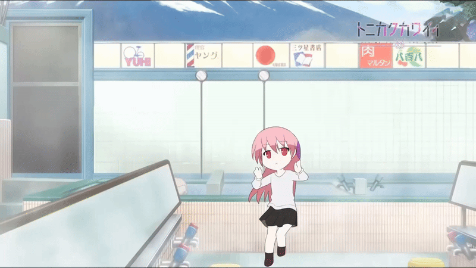

<div align='center'>
<a href="https://git.io/typing-svg"></a>
</div>

<h3 align='center'>🎓 an ordinary student at State Vocational High School 4 Tangerang</h3>

<div align='center'>
    
</div>

---
## 🚀 About Me

```javascript
const MySelf = {
    name = "Rizky Wahyu Hidayah",
    location = "Tangerang, Indonesia",
    role = "Junior Web Developer",
    hobbies = "Learning a new language",
    funFact = "I always have my own way to fix problem"
};
```

- 🎯 Currently learning and deepening my skills in **React & Express**
-  Looking to collaborate on **interesting web development projects**
- 📫 Reach me at: **rizkywahyuuuw@gmail.com**
- ⚡ Fun fact: **I love exploring new technologies and always curious about new languages and cultures.!**

---
## ⚙️ Tech Stack
### 💻 Backend Development
<div align="left">
  
</div>

### 🎨 Frontend Development
<div>
    
</div>

### 🛠️ Tools
<div>
    
</div>

---

<div align='center'>


</div>

---

